#   KernTool4 

KernTool4 is an extension for working with Kerning and glyph Margins in Robofont4.

```
version history:
4.0.1 first release
```
> ### Key features of KernTool4:
> - the ability to work in parallel with several fonts at once
> - quick and easy switching between Kerning and Margins edit modes
> - checking Kerning pairs for language compatibility
> - checking Margins between glyphs in kerning groups
> - compatible with Robofont4, Merz, Subscriber

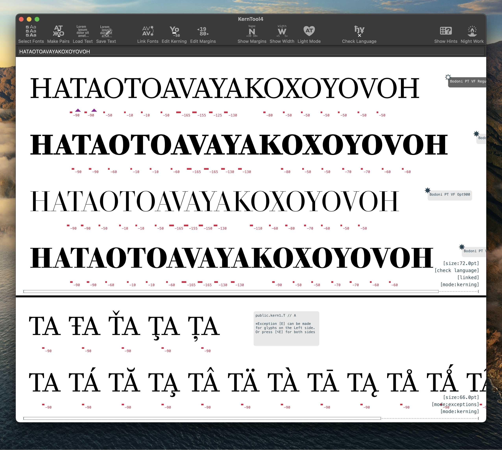

## How to get started with kerning?
First, consider the example of working with a single font.

_Please, if you have several fonts open at once - click `Select Fonts` and uncheck all but one._

In KernTool4, you can quickly create a set of pairs, or you can load them from a text file.
To create a set of pairs, click `Make Pairs`

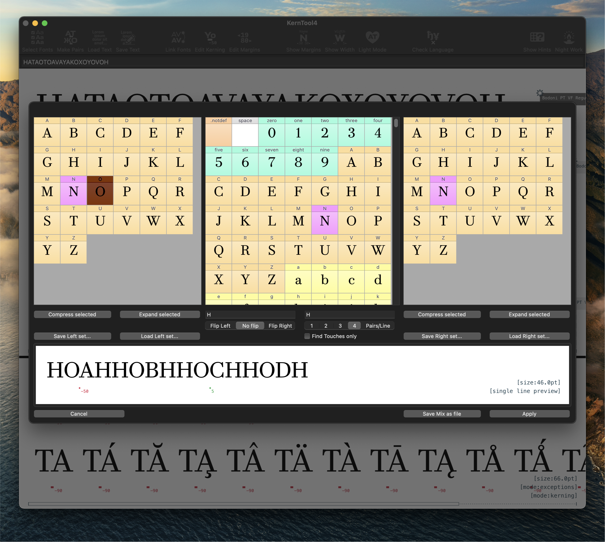

In the center is a set of all glyphs in your current font.

Drag the glyphs that need kerning to the left and right pockets, an example of how one line from a set of pairs will look at the bottom.

Having selected one of the glyphs in the left pocket, you can see examples with it.

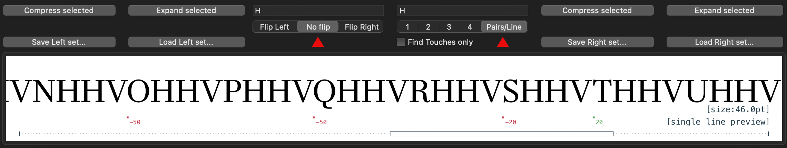

Pairs are created according to the rule: for each glyph from the left pocket, a pair will be created with all the glyphs from the right pocket. To better understand the rhythm of the pairs, you can add some sign to each pair on the left and right, for example H for capital Latin, or 0 for numbers, these characters can be entered into text fields, there may be several such characters. (If non-unicode characters are needed, they can be entered in the `/glyphname` format)

If you select all or several glyphs in the left or right pocket and press `Compress` - you can reduce the number of characters in the pocket. All glyphs that are in the same group with the selected ones will be removed from the pocket, since they most likely do not need separate kerning from the group. If you press `Expand` on the selected glyphs in the pocket, then on the contrary, all the glyphs that are grouped with the selected ones will be added to the pocket.

The number of pairs in a line can be adjusted with the switch `1-2-3-4-Pairs / Line`, of course, you can not limit the number, in this case all pairs for each glyph on the left will be included in the line and this will affect performance.


Sometimes, when you need to work with symmetric signs, it is useful to try the `flip` switch, see below how the pairs will form. For each glyph from the left pocket, characters from the right pocket, or vice versa, will be added to the left and right.

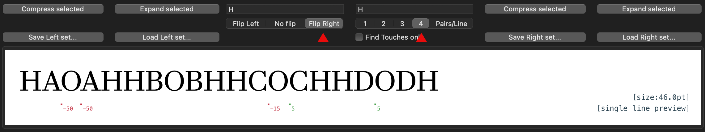

Glyphs in pockets can be sorted by drag and drop.
If you need to check if there are any touched glyphs in pairs among the selected signs - you can enable the option `Find Touches only`.

Once you have made sure that you have collected all the necessary characters, each of the pockets can be saved as a file for later use.

Then you can click `Apply` and go to kerning.

## How to work with kerning?

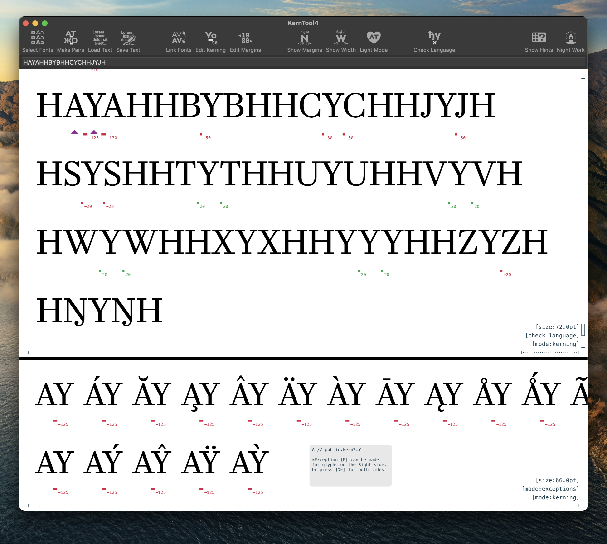

At the top of the window, you see the newly created set of pairs in the form of text or text loaded from a file. If you select any pair at the top of the window, then at the bottom you will see two lines of pairs - this is how sets of characters from groups interact with these glyphs.

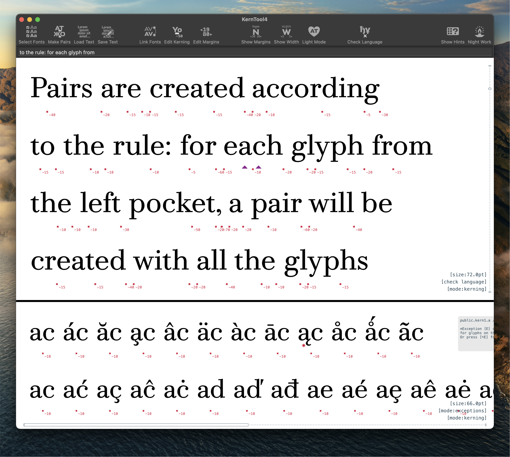

The pairs can be switched with the `TAB` key to move to the next pair or `alt+TAB` to the previous pair. Move through lines - `UP` and `DOWN` arrow.

```
TAB = next pair
alt+TAB = previous pair
```

By pressing the `LEFT` or `RIGHT` arrows on the selected pair, we create or change kerning between characters. 

Moreover, this can be freely done both in the upper part of the window and in the lower part, but in the lower part it is allowed to create `exceptions`.

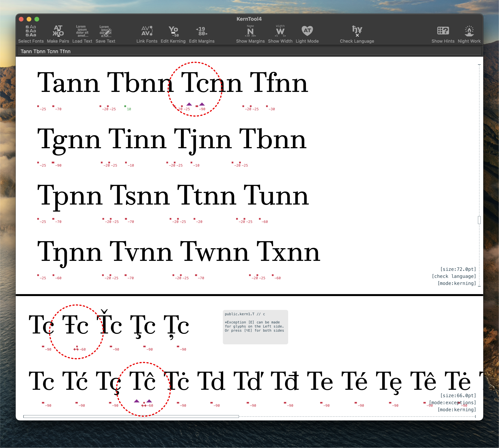

Pressing the `LEFT` arrow decreases kerning by `-10`, and pressing the `RIGHT` arrow increases by `+10`. To speed up the work, you can immediately after pressing the left or right arrow, press the number `2,3..9,0`. In this case, the last entered value will be multiplied by this number. For example, `LEFT` arrow and pressing `6` will decrease by `-60`, while `RIGHT` arrow and `0` will give `+100`.

```
Left = -10;             Right = +10; 
Shift+Left = -5;        Shift+Right = +5;  
Alt+Left = -1           Alt+Right = +1

press a digit to multiply the last value:
* 2, 3, .. 9, 0 = ( 20, 30, .. 90, 100 )
```

If at the bottom of the window you see that any of the pairs of characters needs to be excluded from the group kerning - select it and press `[E]xception`, in the first line an exception will be created for the glyph on the left, in the second line for the glyph on the right, if the pair needs a mutual exclusion, press `alt+[E]`. Each type of exception is indicated by the sign of lightning, and an arrow in the direction of the excluded glyph, and if mutual exclusion - double lightning.

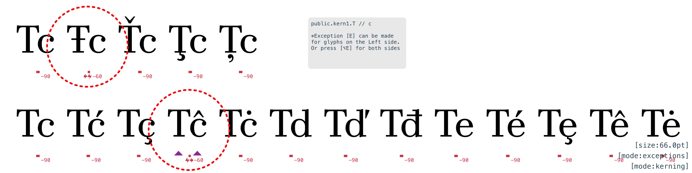

In the upper part of the window, pairs can be flipped by pressing `[F]lip`, to switch the selected pair at the top from the selected one at the bottom - `[S]witch`. Remove pair kerning or exception - `[backspace]`.

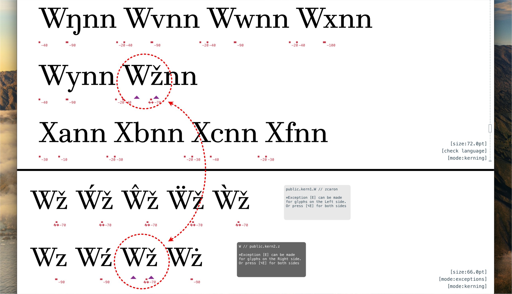

By entering any text in the edit field, you can change the text of the selected line and, if necessary, save the corrected text to a file.

All kerning changes are instantly made to the font and displayed in the _Space Center_.

> ### Checking margins
> At the bottom of the window, the interactions of pairs from groups are shown in two lines. Sometimes glyphs with different margins are found in groups. This is normal, but to better control it, KernTool4 marks glyphs whose margins differ from wildcards with an asterisk.
> 
> A good rule of thumb is to create a group where the first glyph is the "base" character, it is with this that the margins are compared for all characters in the group. Comparison of margins takes into account the side of the group, if the group is on the left - the right margins will be checked and vice versa.
> 


## How to work with margins?
If you notice a red asterisk next to a glyph, it means that its margin is different from the first character in the group. To check this you can enable `Show Margins`. It often happens that margins do not match in composite signs, due to some component. When viewing margins, you can additionally turn on `Beam`, this is a beam similar to `Beam` from _Space Center_, it will show the real offset of margins. (You can control the height of the `Beam` using the buttons `UP` and `DOWN`, in more detail just below)

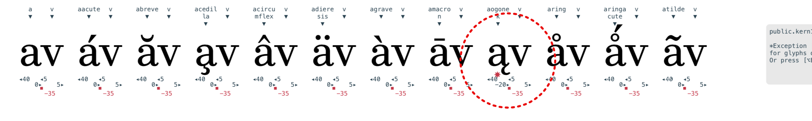
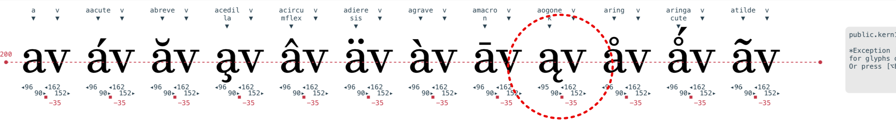

If, nevertheless, the glyph needs editing margins, you can switch to the edit margins mode - `Edit Margins`

> To quickly switch between editing kerning and margins
you can just press the shortcut `[M]ode`


At the moment of switching to editing margins, the current pair in the lower part of the window will be shown without splitting into pairs. The margins of each character can be changed with the left and right arrows, similar to the _Space Center_. Just like in Kerning, you can press any digit to multiply the last entered value.

```
Left margin:            Right margin:
Shift+Alt+Left = -10    Shift+Left = -10
Alt+Left = -1           Left = -1
Shift+Alt+Right = +10   Shift+Right = +10
Alt+Right = +1          Right = +1

press a digit to multiply the last value:
* 2, 3, .. 9, 0 = ( 20, 30, .. 90, 100 )
```

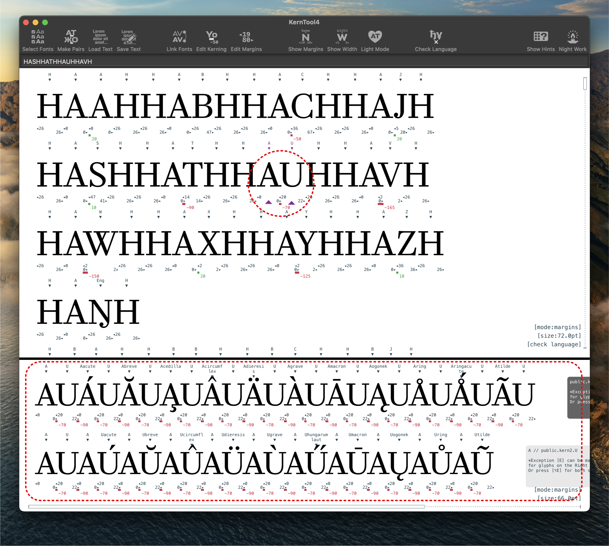

This was the "quick edit" mode of margins. You can just tweak the glyph and switch back to kerning.
***

However, KernTool4 allows you to work more deeply and productively with margins.
After you have switched from kerning to margins, at the top of the window, the cursor will start dancing, offering to select one group of characters. After selecting one of the characters, you will see a special glyph pattern at the bottom of the window.


To create this pattern for editing margins, KernTool4 creates a virtual line of glyphs consisting of characters included in the group with the selected glyph and adds composite characters collected from base characters in this group to it, thus creating a list of characters dependent on margins with a selected glyph. Each such glyph on the left and right is framed with an `H` for Latin uppercase characters and `Н` for uppercase Cyrillic characters, for
lowercase Latin will be `n`, and for Cyrillic `н`, respectively. Digits are split with a `0`, and unrecognized characters - with a `space`. These patterns are generated automatically based on glyph case and language.

_For now, you can customize these patterns by editing XML files from KernTool4 resources ._
***
It is important to understand that by changing the margin at the base sign for composites, the margin for all composites will automatically change, while the position of accents and anchors will also shift by the amount of change in the base one. For example, by changing the left margin at the sign `A`, we thereby change its width, and these edits will automatically be applied to all dependent composites, and the accents will be shifted by an equal amount relative to the left margin. If the margins change only for a composite sign that has no child signs, the margins will change only for it.

It is advisable not to use long chains of composites heirs, when one of the components is a child of another component and further. In this case, changes in margins in the base sign will only be transferred to the composites of the first link.

_This is an experimental feature so far. In the future, special `metric groups` can be used to create such patterns and line of glyphs._

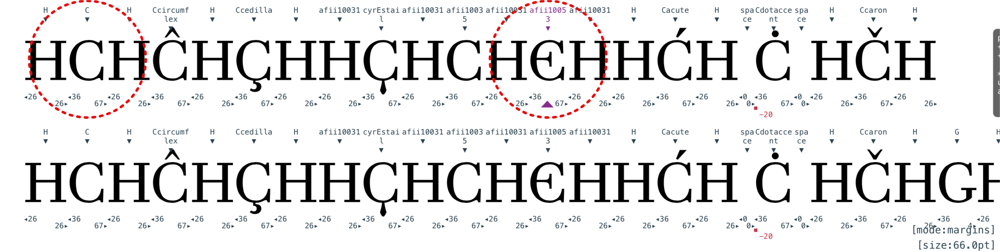
***
In the margin editing mode, it is useful to turn on `Beam`, its height is adjusted with the `UP` and `DOWN` arrows in `10` units. Pressing `shift+` will change the height by `100` units, `alt+` by `1`.

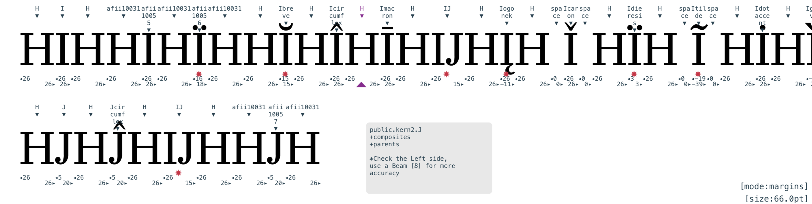
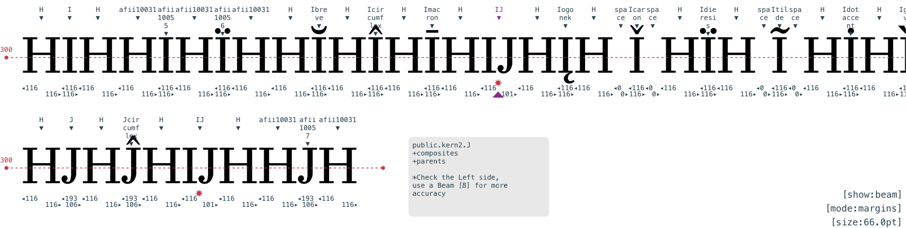

> #### Helpful advice
> To work with margins, you can create a set of pairs where there will be a basic "rhythmic" sign in the left pocket, for example `Н`, put all the glyphs you are planning to work with in the right pocket, and enter the same character from the left pocket into the right text block... This will create a nice test text for checking and editing margins. And of course you can create your own pattern and load it from a text file.
> 
>`HAHHBHHCHHDHНЕН`
> 
> 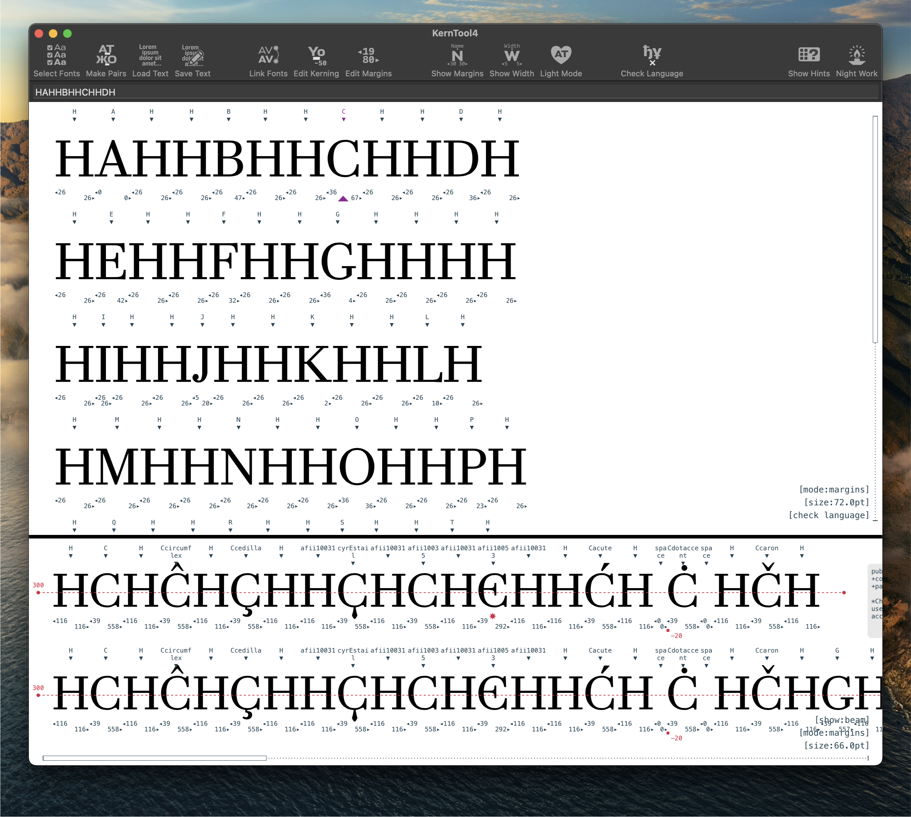

## Language compatibility in kerning
Often working with the signs of unfamiliar alphabets, we may not know that some combination of signs does not make sense, since these signs never occur together. Also, to reduce the number of pairs, it can be useful to keep track of the sometimes appearing interlanguage pairs.

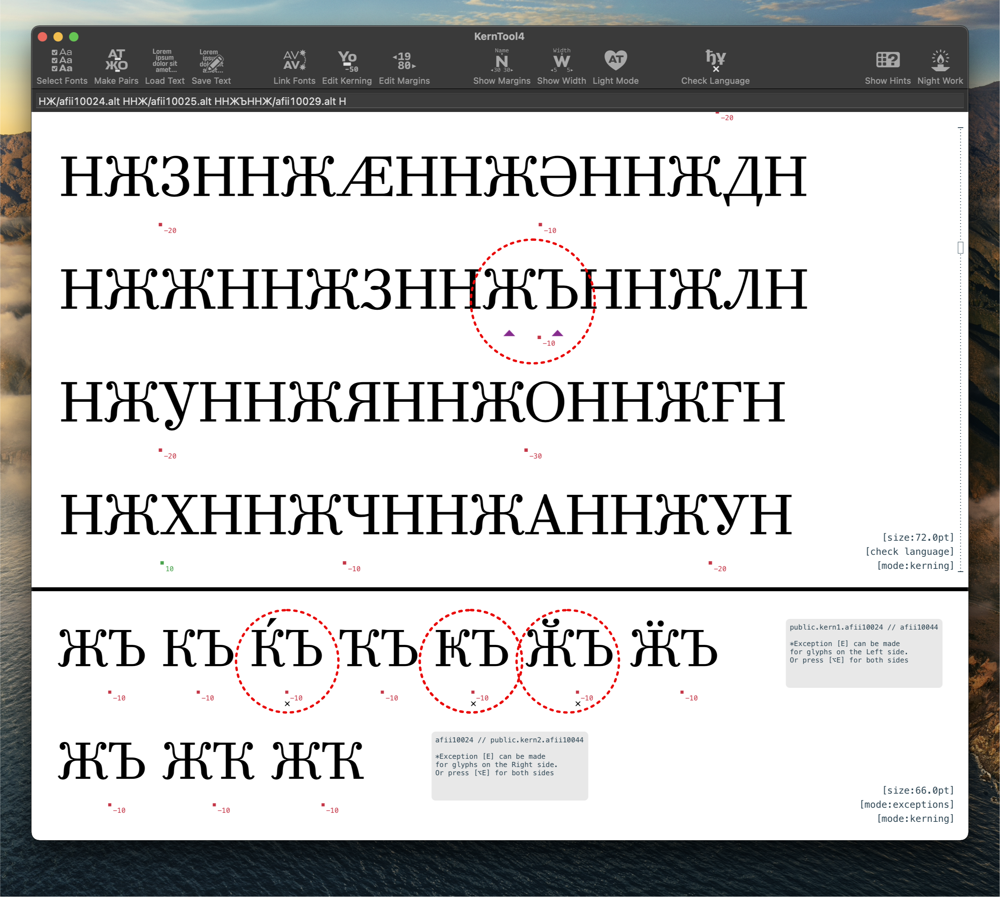

This is an experimental feature so far. If you enable `Check Language`, then pairs that do not make sense will be marked with a `cross`. Language data is taken from the XML database, in the KernTool4 resources. It is not complete and so far only contains basic languages, so KernTool4 shows incompatible pairs only if there is information about it in the database. KernTool4 compares the composition of unicodes from different language tables, and if there are no intersections in these tables, such languages are considered incompatible. Of course, when you work with group kerning, you can ignore the incompatibility of some characters within a group, but often it helps a lot when you need to decide whether to make an exception or when completely incompatible groups from different alphabets are encountered.

## How to work with multiple fonts at once?
The key feature of KernTool4 is its ability to work with multiple fonts at once.

By default, KernTool4 displays pairs for all open fonts at once. You can select the required fonts and sort them in the desired order in `Select Fonts`.

When there are several fonts, they can be linked - `Link Fonts` (shortcut `L`). 

When you are working with multiple fonts, any generated arrays of pairs or downloads will be split into lines, where each line belongs to a different font. Each line is signed with the name of the font, and linked lines are indicated by an asterisk.

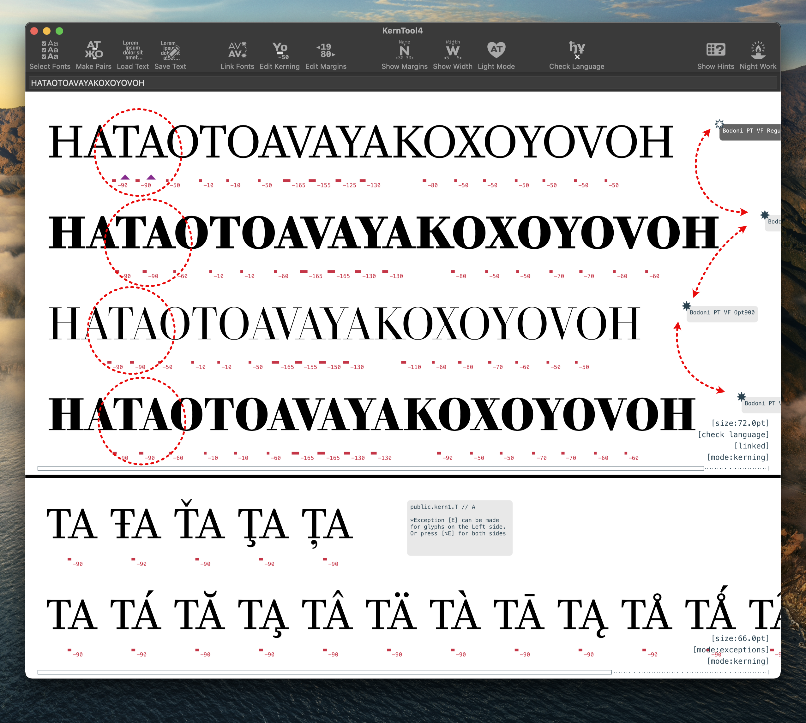

Then, if kerning is edited at the top of the window, changes will occur in all selected fonts. This will add kerning offsets to the existing value. For example, if in `font 1` the pair `AT` is `-50`, and in `font 2` the value is `-80`, then pressing the left arrow will give the value `-60` in `font 1` and `-90` in `2`.


_In the future, it is planned to include coefficients, and rules for the relationship of fonts_

If kerning is edited at the bottom of the window, these changes are considered local and affect only the selected font. This also applies to exceptions as they are only thrown at the bottom.
If the fonts are unlinked, then kerning editing in the upper and lower parts will be for only one font.
It is important to understand that the composition of groups for each font _may be different_, KernTool4 works with kerning of each font independently, taking into account the group composition, even when they are linked. But if there are significant differences in the groups, unreasonable exceptions may appear, it is better to avoid this.

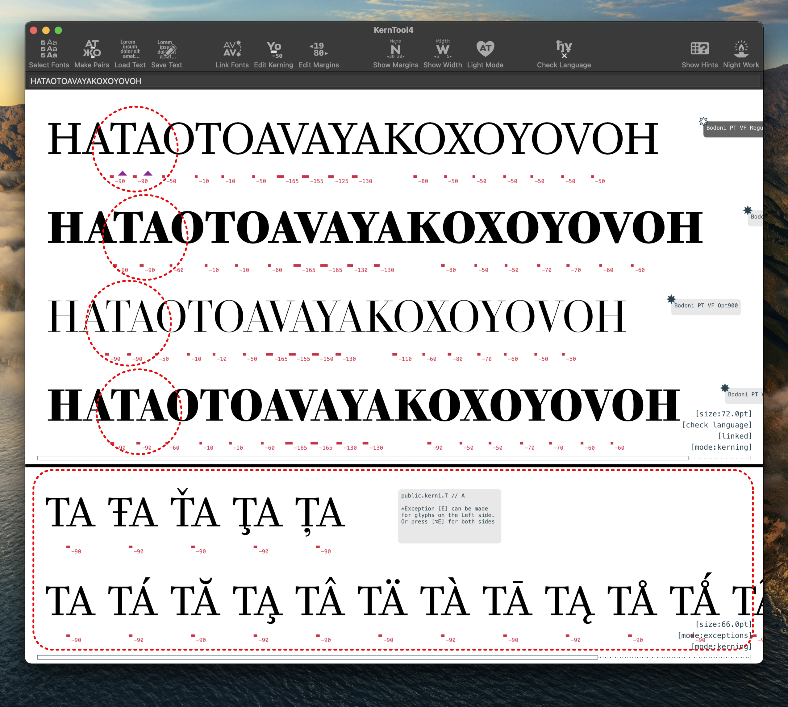
***
When switching to margin editing, work is done with each font separately; for margins, font links are not yet applicable.

_But in the future it is planned to feature coefficients and rules for the ratio of margins between fonts ._
***

### Some limitation
When loading text from a file, it is forced to break into lines of a certain width, while there is no way to change this width.

I do not recommend enabling margins viewing when the font size is less than 42pt

Too many pairs or too long text can reduce the performance of KernTool4. So far I have conducted tests with texts of no more than 10,000 characters and 9,000 kernig pairs.

***
KernTool4 is compatible with KernFinger from the KernTool3 suite, while I am working on updating KernFinger and KernGroups, they can be used in Robofont4 in conjunction with KernTool4.

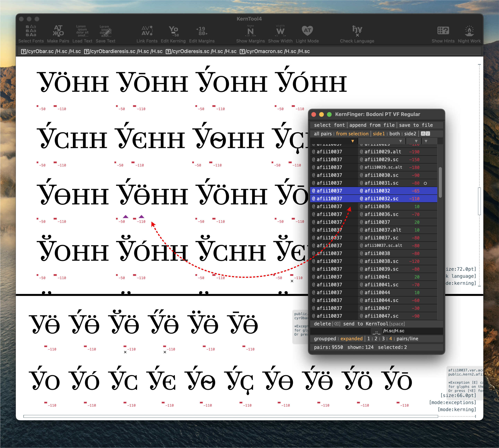

>The presentation uses the Bodoni PT font created by Paratype, in the process of work, so some margins and kerning values may differ from the release.


