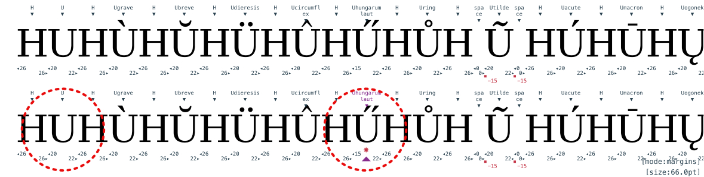
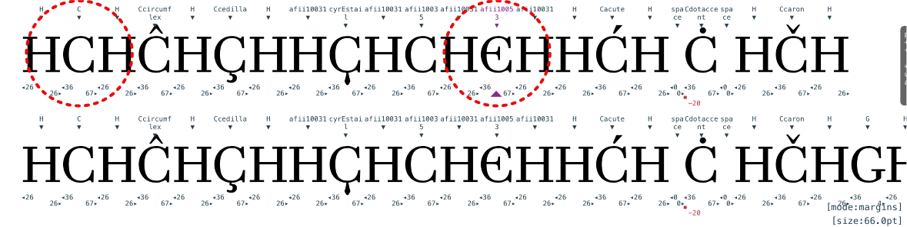
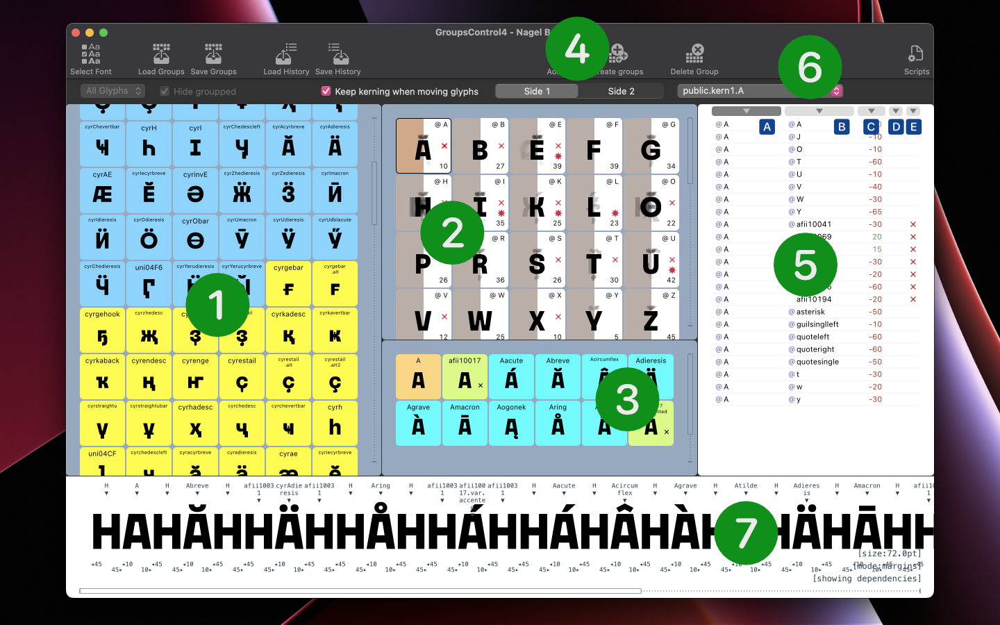
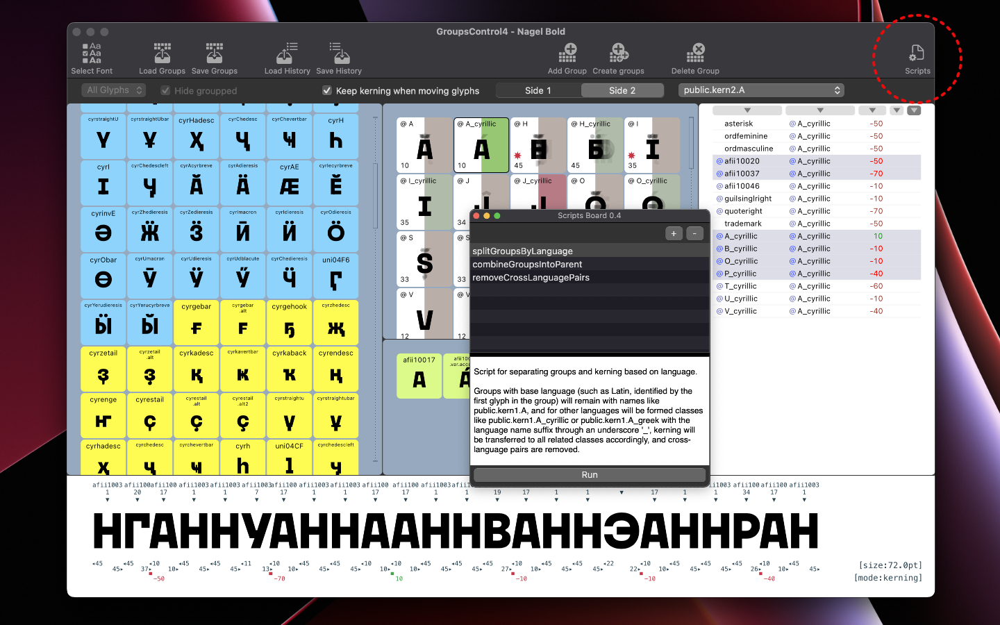

#   KernTool4

KernTool4 is a set of extensions for working with kerning, glyph margins and groups in Robofont4.

---

#### Version history:
- `4.3.0` - Added two parts of the extension - `PairsList` and `SpaceArk` _(Documentation will come later)_. Fixed to support `Robofont 4.4`

- `4.1.6` - `GroupsControl:` fixed to support Robofont 4.3
- `4.1.5` - `GroupsControl:` added buttons `Delete/Send to KernTool` to PairsList and added option `Rename Group`. Improved sorting of the PairsList
- `4.1.4` - `GroupsControl:` fixed a bug with the closing of the SсriptsBoard when the `GC` was closed. LangSet now will make patterns library for AllFonts. Updated `Scripts` for `GC`.
- `4.1.3` - `GroupsControl` fixed bug with missing key glyph in group 
- `4.1.2` - Added the ability to specify kerning scaling to KernTool ([see description below](#kerning-scaling)). Improved operation of the SelectFonts window. 
- `4.1.1` - added `GroupsControl` - extension for working with kerning groups ([see description below](#-groupscontrol))
- `4.0.2` - fixed import of AppKit for Monterey support
- `4.0.1` - first release


--- 
> ### Key features of KernTool4:
>
> - the ability to work in parallel with several fonts at once
> - quick and easy switching between Kerning and Margins edit modes
> - checking Kerning pairs for language compatibility
> - checking Margins between glyphs in kerning groups
> - compatible with Robofont4, Merz, Subscriber


## How to get started with kerning?

First, consider the example of working with a single font.

_Please, if you have several fonts open at once - click `Select Fonts` and uncheck all but one._

In KernTool4, you can quickly create a set of pairs, or you can load them from a text file.
To create a set of pairs, click `Make Pairs`


In the center is a set of all glyphs in your current font.

Drag the glyphs that need kerning to the left and right pockets, an example of how one line from a set of pairs will look at the bottom.

Having selected one of the glyphs in the left pocket, you can see examples with it.


Pairs are created according to the rule: for each glyph from the left pocket, a pair will be created with all the glyphs from the right pocket. To better understand the rhythm of the pairs, you can add some sign to each pair on the left and right, for example H for capital Latin, or 0 for numbers, these characters can be entered into text fields, there may be several such characters. (If non-unicode characters are needed, they can be entered in the `/glyphname` format)

If you select all or several glyphs in the left or right pocket and press `Compress` - you can reduce the number of characters in the pocket. All glyphs that are in the same group with the selected ones will be removed from the pocket, since they most likely do not need to separate kerning from the group. If you press `Expand` on the selected glyphs in the pocket, then on the contrary, all the glyphs that are grouped with the selected ones will be added to the pocket.

The number of pairs in a line can be adjusted with the switch `1-2-3-4-Pairs / Line`, of course, you can not limit the number, in this case all pairs for each glyph on the left will be included in the line and this will affect performance.


Sometimes, when you need to work with symmetric signs, it is useful to try the `flip` switch, see below how the pairs will form. For each glyph from the left pocket, characters from the right pocket, or vice versa, will be added to the left and right.


Glyphs in pockets can be sorted by drag and drop.
If you need to check if there are any touched glyphs in pairs among the selected signs - you can enable the option `Find Touches only`.

Once you have made sure that you have collected all the necessary characters, each of the pockets can be saved as a file for later use.

Then you can click `Apply` and go to kerning.

## How to work with kerning?


At the top of the window, you see the newly created set of pairs in the form of text or text loaded from a file. If you select any pair at the top of the window, then at the bottom you will see two lines of pairs - this is how sets of characters from groups interact with these glyphs.


The pairs can be switched with the `TAB` key to move to the next pair or `alt+TAB` to the previous pair. Move through lines - `UP` and `DOWN` arrow.

```
TAB = next pair
alt+TAB = previous pair
```

By pressing the `LEFT` or `RIGHT` arrows on the selected pair, we create or change kerning between characters.

Moreover, this can be freely done both in the upper part of the window and in the lower part, but in the lower part it is allowed to create `exceptions`.


Pressing the `LEFT` arrow decreases kerning by `-10`, and pressing the `RIGHT` arrow increases by `+10`. To speed up the work, you can immediately after pressing the left or right arrow, press the number `2,3..9,0`. In this case, the last entered value will be multiplied by this number. For example, `LEFT` arrow and pressing `6` will decrease by `-60`, while `RIGHT` arrow and `0` will give `+100`.

```
Left = -10;             Right = +10; 
Shift+Left = -5;        Shift+Right = +5;  
Alt+Left = -1           Alt+Right = +1

press a digit to multiply the last value:
* 2, 3, .. 9, 0 = ( 20, 30, .. 90, 100 )
```

If at the bottom of the window you see that any of the pairs of characters needs to be excluded from the group kerning - select it and press `[E]xception`, in the first line an exception will be created for the glyph on the left, in the second line for the glyph on the right, if the pair needs a mutual exclusion, press `alt+[E]`. Each type of exception is indicated by the sign of lightning, and an arrow in the direction of the excluded glyph, and if mutual exclusion - double lightning.


In the upper part of the window, pairs can be flipped by pressing `[F]lip`, to switch the selected pair at the top from the selected one at the bottom - `[S]witch`. Remove pair kerning or exception - `[backspace]`.


By entering any text in the edit field, you can change the text of the selected line and, if necessary, save the corrected text to a file.

All kerning changes are instantly made to the font and displayed in the _Space Center_.

### Kerning scaling.
In the `SelectFonts` window, you can select a kerning scaling factor for each font. This multiplier will be applied to all kerning values entered. So, for example, with a multiplier of `0.8` for the first style, `1` for the second, and `1.2` for the third, if you enter `-10` in the first style, the kerning will change to `-8` (-10*.8), in the second, as usual `-10`, and in the third `-12`. Entering `+5` will give `+4` in the first style, `+5` in the second, and `+6` in the third. The multiplier is also applied to values entered from the keyboard with numbers. The range of the multiplier is unlimited, but applies to all input values except `-1 and 1`. If these values are entered, they will be applied without the multiplier.

Such scaling can also be used if you need to change the standard `10/5` kerning step to something more convenient for the current project.


> ### Checking margins
>
> At the bottom of the window, the interactions of pairs from groups are shown in two lines. Sometimes glyphs with different margins are found in groups. This is normal, but to better control it, KernTool4 marks glyphs whose margins differ from wildcards with an asterisk.
>
> A good rule of thumb is to create a group where the first glyph is the "base" character, it is with this that the margins are compared for all characters in the group. Comparison of margins takes into account the side of the group, if the group is on the left - the right margins will be checked and vice versa.
> 

## How to work with margins?

If you notice a red asterisk next to a glyph, it means that its margin is different from the first character in the group. To check this you can enable `Show Margins`. It often happens that margins do not match in composite signs, due to some component. When viewing margins, you can additionally turn on `Beam`, this is a beam similar to `Beam` from _Space Center_, it will show the real offset of margins. (You can control the height of the `Beam` using the buttons `UP` and `DOWN`, in more detail just below)


If, nevertheless, the glyph needs editing margins, you can switch to the edit margins mode - `Edit Margins`

> To quickly switch between editing kerning and margins
> you can just press the shortcut `[M]ode`

At the moment of switching to editing margins, the current pair in the lower part of the window will be shown without splitting into pairs. The margins of each character can be changed with the left and right arrows, similar to the _Space Center_. Just like in Kerning, you can press any digit to multiply the last entered value.

```
Left margin:            Right margin:
Shift+Alt+Left = -10    Shift+Left = -10
Alt+Left = -1           Left = -1
Shift+Alt+Right = +10   Shift+Right = +10
Alt+Right = +1          Right = +1

press a digit to multiply the last value:
* 2, 3, .. 9, 0 = ( 20, 30, .. 90, 100 )
```


This was the "quick edit" mode of margins. You can just tweak the glyph and switch back to kerning.

---

However, KernTool4 allows you to work more deeply and productively with margins.
After you have switched from kerning to margins, at the top of the window, the cursor will start dancing, offering to select one group of characters. After selecting one of the characters, you will see a special glyph pattern at the bottom of the window.



To create this pattern for editing margins, KernTool4 creates a virtual line of glyphs consisting of characters included in the group with the selected glyph and adds composite characters collected from base characters in this group to it, thus creating a list of characters dependent on margins with a selected glyph. Each such glyph on the left and right is framed with an `H` for Latin uppercase characters and `Н` for uppercase Cyrillic characters, for
lowercase Latin will be `n`, and for Cyrillic `н`, respectively. Digits are split with a `0`, and unrecognized characters - with a `space`. These patterns are generated automatically based on glyph case and language.

_For now, you can customize these patterns by editing XML files from KernTool4 resources ._

---

It is important to understand that by changing the margin at the base sign for composites, the margin for all composites will automatically change, while the position of accents and anchors will also shift by the amount of change in the base one. For example, by changing the left margin at the sign `A`, we thereby change its width, and these edits will automatically be applied to all dependent composites, and the accents will be shifted by an equal amount relative to the left margin. If the margins change only for a composite sign that has no child signs, the margins will change only for it.

It is advisable not to use long chains of composites heirs, when one of the components is a child of another component and further. In this case, changes in margins in the base sign will only be transferred to the composites of the first link.

_This is an experimental feature so far. In the future, special `metric groups` can be used to create such patterns and line of glyphs._



---

In the margin editing mode, it is useful to turn on `Beam`, its height is adjusted with the `UP` and `DOWN` arrows in `10` units. Pressing `shift+` will change the height by `100` units, `alt+` by `1`.


> #### Helpful advice
>
> To work with margins, you can create a set of pairs where there will be a basic "rhythmic" sign in the left pocket, for example `Н`, put all the glyphs you are planning to work with in the right pocket, and enter the same character from the left pocket into the right text block... This will create a nice test text for checking and editing margins. And of course you can create your own pattern and load it from a text file.
>
> `HAHHBHHCHHDHНЕН`
>
> 

## Language compatibility in kerning

Often working with the signs of unfamiliar alphabets, we may not know that some combination of signs does not make sense, since these signs never occur together. Also, to reduce the number of pairs, it can be useful to keep track of the sometimes appearing interlanguage pairs.


This is an experimental feature so far. If you enable `Check Language`, then pairs that do not make sense will be marked with a `cross`. Language data is taken from the XML database, in the KernTool4 resources. It is not complete and so far only contains basic languages, so KernTool4 shows incompatible pairs only if there is information about it in the database. KernTool4 compares the composition of unicodes from different language tables, and if there are no intersections in these tables, such languages are considered incompatible. Of course, when you work with group kerning, you can ignore the incompatibility of some characters within a group, but often it helps a lot when you need to decide whether to make an exception or when completely incompatible groups from different alphabets are encountered.

## How to work with multiple fonts at once?

The key feature of KernTool4 is its ability to work with multiple fonts at once.

By default, KernTool4 displays pairs for all open fonts at once. You can select the required fonts and sort them in the desired order in `Select Fonts`.

When there are several fonts, they can be linked - `Link Fonts` (shortcut `L`).

When you are working with multiple fonts, any generated arrays of pairs or downloads will be split into lines, where each line belongs to a different font. Each line is signed with the name of the font, and linked lines are indicated by an asterisk.


Then, if kerning is edited at the top of the window, changes will occur in all selected fonts. This will add kerning offsets to the existing value. For example, if in `font 1` the pair `AT` is `-50`, and in `font 2` the value is `-80`, then pressing the left arrow will give the value `-60` in `font 1` and `-90` in `2`.

_In the future, it is planned to include coefficients, and rules for the relationship of fonts_

If kerning is edited at the bottom of the window, these changes are considered local and affect only the selected font. This also applies to exceptions as they are only thrown at the bottom.
If the fonts are unlinked, then kerning editing in the upper and lower parts will be for only one font.
It is important to understand that the composition of groups for each font _may be different_, KernTool4 works with kerning of each font independently, taking into account the group composition, even when they are linked. But if there are significant differences in the groups, unreasonable exceptions may appear, it is better to avoid this.


---

When switching to margin editing, work is done with each font separately; for margins, font links are not yet applicable.

_But in the future it is planned to feature coefficients and rules for the ratio of margins between fonts ._

---

### Some limitation

When loading text from a file, it is forced to break into lines of a certain width, while there is no way to change this width.

I do not recommend enabling margins viewing when the font size is less than 42pt

Too many pairs or too long text can reduce the performance of KernTool4. So far I have conducted tests with texts of no more than 10,000 characters and 9,000 kernig pairs.

---

KernTool4 is compatible with KernFinger from the KernTool3 suite, while I am working on updating KernFinger, they can be used in Robofont4 in conjunction with KernTool4.


> The presentation KT4 uses the Bodoni PT font created by Paratype, in the process of work, so some margins and kerning values may differ from the release.

---
---

#  GroupsControl

GroupsControl is an extension for working with kerning groups in RoboFont 4.

> Main features of the extension:
> - create and delete groups based on existing kerning
> - automatic resolution of pair conflicts when moving glyphs between groups
> - checking and editing margins in a group
> - check and edit kerning pairs associated with glyphs and groups
> - check for language compatibility between glyphs in a group and kerning pairs
> - it is possible to connect your own scripts to work with groups


## Basic functions

`Add Group` - by selecting one glyph or several, you can create a group of them, while the name of the group will be automatically generated from the name of the first glyph.

`Create groups` - for each selected glyph, its own group will be created, the group name will be given by the name of the glyph.

`Delete group` - deletes selected groups.


You can add or remove glyphs by simply dragging and dropping.



1. All glyphs included in the font. By default, all glyphs that are already in the group are hidden.
2. List of groups in the font. Group names shortened from `public.kern1/2.name` to `@name`. The opposite side of the group position is darkened by the mask. The numeric value in the group corner is the margin of the first character in the group from the side of the group position.
3. The composition of the glyphs of the selected group.
4. `Side1`/`Side2` - group position switch

5. List of kerning pairs associated with the selected group or glyph.

6. Buttons for sorting the list of kerning pairs.

- A. Side 1.
- B. Side 2.
- C. Value of the pair.
- D. Exception.
- E. Language compatibility.

7. Margins and kerning `Editor`

It is believed that in UFO the order of glyphs in a group does not matter, however, to simplify some functions in GroupsControl, it was decided to consider the first glyph in the group as the key one and determine the difference in margins for the remaining glyphs, as well as the language compatibility of glyphs in the group.


`1` Cross ❌ - there are glyphs from different languages in the group. 

_The first glyph in the group `E` is from the Latin alphabet, but there are also several glyphs from the Cyrillic alphabet in the group._

`2` Asterisk 🛑 - there are glyphs in the group with margins different from the first character in the group.

_The first glyph in the `E` group on the right has a margin of 39, but several glyphs have different margins of 38 and 32._

If you select a glyph or a group, a line is formed at the bottom of the window from the composition of the group, composites and / or parent characters, and on the right - a list of kerning pairs for the group or selected glyph. If you select one or more kerning pairs, they will also be shown at the bottom.

The lower part is the `Editor` completely similar to KernTool4, but works according to the context - if glyphs or groups are selected - you can edit the margins, if the kerning pairs are selected - you can edit the kerning of these pairs. It should be understood that in the `Editor`, as well as in KernTool4, not only glyphs from the group are shown, but also all composites assembled from them. A change in the margins of the main sign leads to a change in the margins only of its composites, but not vice versa.


This cannot replace KernTool, but in some cases it helps a lot to solve minor problems "here and now". When editing margins, it is useful to turn on `Beam [B]` - it, similarly to Space Center, shows the distance from the edge of the site to the intersection of the beam with the glyph. The up and down arrows control the height of the beam.

Hotkeys are the same as in KernTool
```
Left margin:            Right margin:
Shift+Alt+Left = -10    Shift+Left = -10
Alt+Left = -1           Left = -1
Shift+Alt+Right = +10   Shift+Right = +10
Alt+Right = +1          Right = +1

Kerning values:
Left = -10;             Right = +10; 
Shift+Left = -5;        Shift+Right = +5;  
Alt+Left = -1           Alt+Right = +1
```


### Check for language compatibility of glyphs in groups and pairs

The composition of groups is checked for primary language compatibility - by the difference in script languages. The list of pairs is checked more deeply - by the difference in scripts and by the compatibility of languages within the same script. For example, if the first glyph in a group is in the Latin script, that group is considered to be Latin, and all glyphs in other scripts (such as Cyrillic or Greek) are marked with a cross. To reduce the number of cross-language pairs during font generation, it is recommended to separate such groups by language and remove cross-language pairs. In the List of Pairs window, you can see such pairs - pairs from different scripts are marked with a red cross, pairs from different languages are marked with a green cross, pairs that are probably meaningless as they belong to different languages, but within the same script, and will never meet in real life.


In this example, you can see that there are pairs `Y + ĵ` and `X + ĵ`. These pairs are exceptions. All these characters belong to the Latin script, but the sign `ĵ` is found in Esperanto where there are no letters `Y` and `X`, so most likely they will never meet, so let's be careful. The same applies to the kernig of the Latin `T Y X` and Ukrainian `ї` `afii10104`, which is probably confused with the Latin `idieresis`. Such a pair is considered a cross-language pair between Latin and Cyrillic, and will definitely never meet in the same word. But still, it is worth checking the composition of the `@T @Y @X` groups, perhaps such kerning was done due to the fact that these groups contain Cyrillic `T Y X`. Additionally, it is worth checking the combination of Kazakh `Y` and `ї`, since such a pair is definitely unnecessary.

Of course, it is up to the designer to decide whether such pairs should be preserved in the font.

GroupsControl uses the same language base as KernTool4. It is located in the extension in the `/resources/langset` folder.


## Automatic pair conflict resolution


`Keep kerning when moving glyphs` - 
when moving glyphs between groups, creating and deleting groups, the presence of kerning on the glyph or group will be checked and possible conflicts will be resolved:

1. if a group is created on the basis of the glyph, then if there is any kerning with the glyph, it will be converted to a group
2. if a glyph with an existing kerning is added to a group - the compatibility of such kerning with the group kerning will be checked - if the values of the pairs are identical to the group ones, then the glyph will be cleared of kerning and simply join the group, if the glyph has pairs that differ from the group - such pairs will be saved as exceptions for this glyph in a group
3. when deleting a glyph from a group, group kerning will be saved on the glyph as exceptions
4. deleting a group - first, operation #3 will be performed for each glyph from the group, and then the group will be deleted
5. moving a glyph from group to group is a sequence of operations #3 and #2

In fact, with each operation with moving glyphs, the kerning of related groups is decompressed into flat kerning, everything that is unnecessary among the resulting pairs is removed and then compressed again into group kerning. The result of the operations is immediately displayed in the List of Pairs, and can be corrected if necessary.

`If the checkbox is disabled`, the creation and deletion of groups, the movement of glyphs will occur without regard to kerning. For example, deleting a group will remove the pairs associated with the group without saving the pairs on separate glyphs as in step #3, and deleting a glyph from the group will also happen without saving the group kerning on it.

---
### A small example from practice

While working on the font, it seemed to me a good idea to put the Cyrillic `У` together with the Latin `Y` in the same group.

Then I did quite a few kerning pairs with this group. However, in the process of testing, I decided to slightly change the margin of the right side of `У`, and this led to the need to revise almost all pairs with their participation - in some cases, the lowercase ones on the right were too close to `У` compared to `Y`.

Since it was not convenient to make exceptions for such a number of pairs, I removed the Cyrillic `У` from the Latin group using the `Keep kerning when moving glyphs` function, and then simply combined them again selecting and clicking `Add Group`, but into a separate Cyrillic group.

All existing kerning from `Y` was thus copied to `У`, and then I only had to correct a few kerning pairs with her participation.


---

## Operations with groups


`Load/Save Groups` - saves or loads to/from txt file.

When groups are loaded from a file, all existing kerning groups will be deleted, so if groups are imported into a font with existing kerning, it is recommended to first remove the kerning.


`Load/Save History` - any movement of glyphs, creation and deletion of groups are recorded as a "history" of operations. This history can be saved as a txt file and then applied (loaded) to other fonts. It helps a lot when working with several masters - when in the process it suddenly becomes necessary to shuffle several groups, but doing the same operations in 10+ styles is too tedious. No changes to the margins and kerning values in pairs are recorded in the history, and the kerning reformatting will be done for the current font.

### Why is it important to distinguish between Load/Save Groups and Load/Save History?
When several masters already have kerning, the composition of the groups is usually identical, but the kerning and exclusion values can vary greatly. If there is a need to correct the composition of groups with existing kerning and transfer these changes to other styles, then just saving/loading the new composition of groups is not enough. It is necessary to carry out all the same edits in all masters, since kerning is taken into account when glyphs are moved, and it is different in masters when simply loading a new group composition - most likely, part of the kerning will be lost or erroneous pairs will occur. For such situations, you need a record of operations - operations with groups are recorded, and they are common to all masters, and the application of these operations will take into account the kerning values in the master to which they are applied.

_As long as there are no History controls, recording starts from the moment the extension is launched, and resets after it is closed, after saving the history or switching to another font. In the future, functionality is needed so that you can stop, turn on and generally check what has been recorded. So far, this is only possible in a saved file._

## Additional features

`Scripts` - calls a window for connecting and running additional external scripts. These scripts can be downloaded from the repository in the [scripts](/scripts) folder and added to `ScriptsBoard`. They use the internal resources of `GroupsControl`, but so far the API capabilities have not been documented.



> The presentation GroupsControl uses the Nagel font created by me and Paratype, in the process of work, so some margins, kerning values and groups composition may differ from the release.